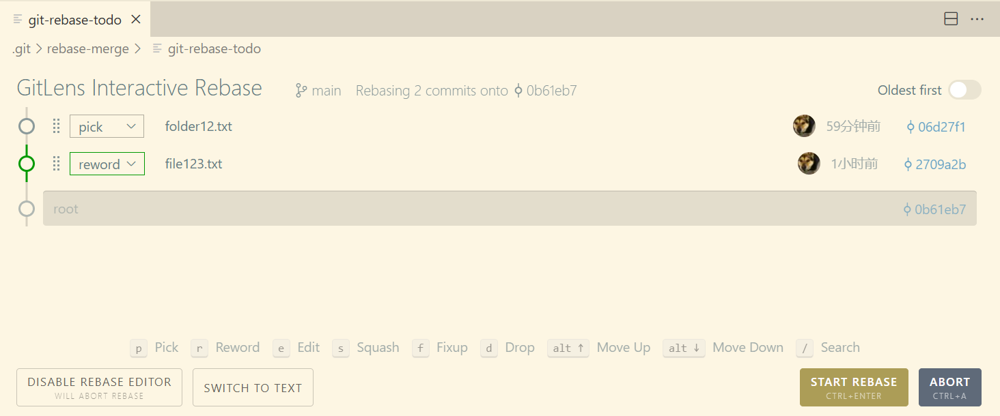

### **界面概述**
你看到的这个界面是 GitLens 插件提供的 **交互式变基 (Interactive Rebase)** 工具，它帮助你在代码仓库中以图形化的方式管理提交历史。以下是界面的主要构成部分：

---

### **1. 界面标题**
```
GitLens Interactive Rebase
```
- **含义**：这是 GitLens 插件提供的交互式变基界面，用于可视化地编辑提交历史。

---

### **2. 变基上下文信息**
```text
Rebasing 2 commits onto 0b61eb7
```
- **含义**：
  - `Rebasing 2 commits`：表示当前正在对 2 个交易进行变基操作。
  - `onto 0b61eb7`：表示这些提交将被重新放置到指定的提交 `0b61eb7` 的基础上。`0b61eb7` 是目标提交的哈希值。

---

### **3. 提交列表**
```text
- pick    folder12.txt
- reword  file123.txt
- root
```
- **含义**：这是变基操作中涉及的提交列表。每一行表示一个提交，左侧的动词（如 `pick`、`reword`）表示对该提交的处理方式：
  - **pick**：保留提交，不做修改。
  - **reword**：修改提交的提交信息（即提交日志的标题和描述）。
  - **root**：表示初始提交（根节点），通常是提交历史的起点。

---

### **4. 每个提交的详细信息**

<table><tr><td style='vertical-align:top; width:400px;'>

```text
- pick    folder12.txt   59分钟前    06d27f1
- reword  file123.txt     1小时前    2709a2b
- root                               0b61eb7
```

</td><td style='vertical-align:top;'>

- **时间**：提交的时间戳，方便你识别提交的顺序。
- **哈希值**：每个提交的哈希值，通常用于唯一标识提交。
- **标题**：提交的日志标题。例如，`folder12.txt` 和 `file123.txt` 是提交的内容或描述。

</td></tr></table>

---

### **5. 操作按钮**
界面下方有一系列操作按钮，帮助你对提交进行管理。以下是每个按钮的功能解释：

#### **(1) DISABLE REBASE EDITOR**
- **功能**：关闭 GitLens 的交互式变基编辑器，恢复到默认的命令行变基模式。
- **注意**：关闭编辑器后，变基操作会被放弃，提交历史不会被修改。

#### **(2) SWITCH TO TEXT**
- **功能**：将界面切换到文本模式，直接编辑变基配置文件（`.git/rebase-todo` 文件）。
- **用途**：如果你更喜欢命令行操作，可以使用此按钮切换到文本模式。

#### **(3) START REBASE (CTRL+ENTER)**
- **功能**：开始变基操作。
- **必要性**：只有点击这个按钮，Git 才会根据你设置的操作（如 `pick`、`reword`）对提交历史进行修改。

#### **(4) ABORT (CTRL+A)**
- **功能**：放弃当前的变基操作。
- **用途**：如果你不再需要进行变基，或者过程中出现了问题，可以使用此按钮放弃操作。

#### **(5) 其他常用的提交操作**

<table><tr><td style='vertical-align:top; width:250px;'>

```text
p Pick
r Reword
e Edit
s Squash
f Fixup
d Drop
alt+↑ Move Up
alt+↓ Move Down
```

</td><td style='vertical-align:top;'>

- **Pick（选择）**：保留提交，不做修改。
- **Reword（重新措词）**：修改提交的提交信息。
- **Edit（编辑）**：在提交后暂停，允许你在变基过程中进行额外的操作（例如添加或删除文件，然后继续提交）。
- **Squash（合并）**：将当前提交与前一个提交合并，共享同一个提交信息。
- **Fixup（修复）**：将当前提交与前一个提交合并，并保留前一个提交的提交信息，丢弃当前提交的日志信息。
- **Drop（丢弃）**：完全删除当前提交。
- **Move Up/Move Down**：上下移动提交的顺序，调整提交的历史顺序。

</td></tr></table>

---

### **6. 提交选择区**
```text
- pick    folder12.txt
- reword  file123.txt
- root
```
- **含义**：你可以点击每一行列的下拉箭头，选择对该提交的操作方式（如 `pick`、`reword` 等）。
- **用途**：通过选择不同的操作，你可以灵活地修改提交历史，例如删除不必要的提交、合并提交、修改提交信息等。

---

### **7. 历史方向选择**
```text
Oldest first
```
- **含义**：显示提交的历史顺序。
- **选项**：
  - **Oldest first**：按时间顺序从老到新显示提交。
  - **Newest first**：按时间顺序从新到老显示提交。

---

### **8. 实时预览**
在变基过程中，你可以看到提交的历史图像（如图中的小圆点和箭头），实时预览提交的顺序和操作结果。

---

### **如何使用界面？**
1. **选择提交操作**：
   - 点击每一行列的下拉箭头，选择对该提交的处理方式，如 `pick`、`reword`、`edit` 等。
   - 例如，你希望修改某个提交的提交信息，可以将其标记为 `reword`。

2. **开始变基**：
   - 点击“START REBASE”按钮，Git 会根据你的设置开始变基操作。

3. **检查和确认**：
   - 如果需要修改提交信息，Git 会打开文本编辑器让你编辑提交的日志。
   - 编辑完成后保存并退出，Git 继续变基。

4. **完成操作**：
   - 变基完成后，检查提交历史，确认提交信息已被正确修改。

---

### **总结**
通过 GitLens 的交互式变基界面，你可以更直观地管理和编辑提交历史。具体步骤如下：
1. 选择对每个提交的操作方式（如 `pick`、`reword` 等）。
2. 点击“START REBASE”开始变基。
3. 如果需要修改提交信息，编辑文本编辑器中的内容。
4. 完成后检查提交历史，确保一切正常。